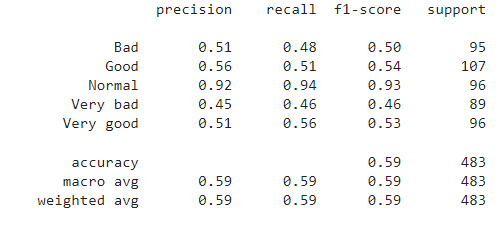

# Depression-Analysis
At First we made a google form for taking our own feelings in some file.
Google form Link  : https://forms.gle/PGo1ndnN8C5UJegq9

We apply different algorithms for analysis of our own depression and happiness Factor.
ANN gives 76% accuracy in test set and 81% highest accuracy in validation set with 100 epoch. Used 4 dense layer with activation function relu and softmax in final layer for calssification.

Diceion Tree Classifier gives 59% accuracy and weighted average f1-score.

